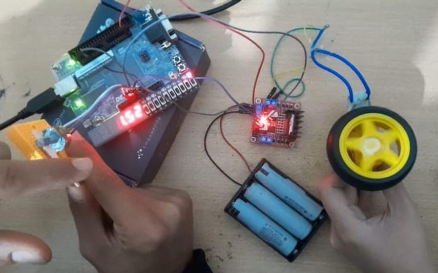
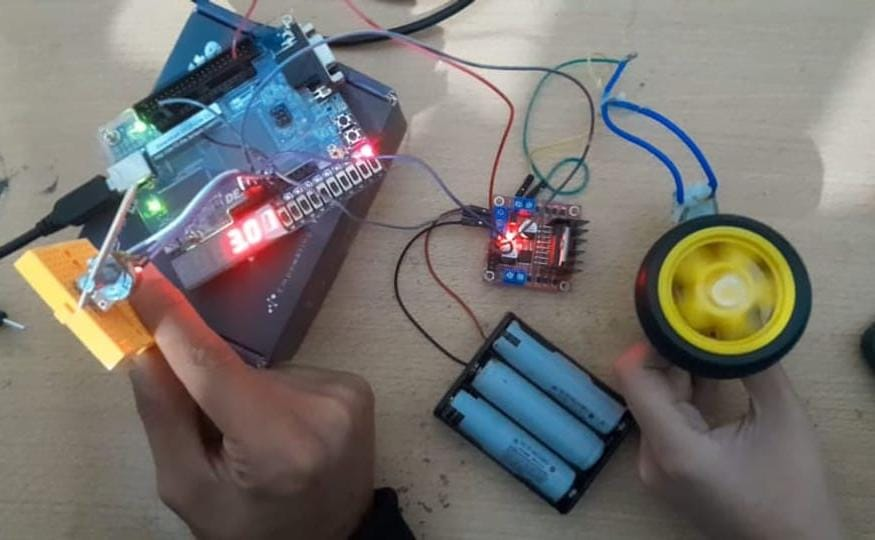

# FPGA-Based Motor Speed Controller using ADC and PWM
This repository contains the implementation of a motor speed control system using an FPGA. The speed is adjusted dynamically through a potentiometer, leveraging ADC for analog-to-digital conversion and PWM for precise motor control.

## 🛠️ Features
- **FPGA Control**: Implements motor speed control with high precision.
- **ADC Integration**: Converts potentiometer input (analog signal) to digital.
- **PWM Generation**: Modulates motor speed based on the ADC output.
- **Real-Time Adjustment**: Dynamically changes motor speed with potentiometer rotation.

## 🖥️ System Overview
<div style="text-align: center; gap: 50px;">
  
  
</div>

1. **Potentiometer**: Provides an analog voltage signal representing the desired motor speed.
2. **FPGA**: 
   - Reads analog input via ADC.
   - Processes the digital value to generate a PWM signal.
3. **PWM Output**: Drives the motor, adjusting its speed based on the potentiometer position.

## 📚 How It Works
1. The potentiometer provides a varying analog voltage (0-5V).
2. The ADC samples the voltage and converts it to a 10-bit digital value.
3. The FPGA processes the ADC value to compute the appropriate PWM duty cycle.
4. The PWM signal is fed to the motor driver, controlling the motor's speed.

## 🔧 Setup Instructions
### Prerequisites
- FPGA Development Board (Altera)
- Motor and driver circuit
- Potentiometer (0-10kΩ)
- Power supply

### Steps
1. Clone the repository:
   ```bash
   git clone https://github.com/WassimHedfi/FPGA_ADC_PWM_MotorControl
   cd FPGA_ADC_PWM_MotorControl
   ```
2. Open the project in your FPGA development environment.
3. Synthesize and program the FPGA with the provided HDL files.
4. Connect the hardware.
5. Test the system by adjusting the potentiometer to vary motor speed.
   
### 📈 Results
The system allows smooth and precise motor speed control in real time.

### 📜 License
This project is licensed under the MIT License. See the LICENSE file for details.
